# GoBypassAV

整理了基于Go的16种API免杀测试、8种加密测试、反沙盒测试、编译混淆、加壳、资源修改等免杀技术，并搜集汇总了一些资料和工具。


免杀专题文章及工具：[https://github.com/TideSec/BypassAntiVirus](https://github.com/TideSec/BypassAntiVirus)

免杀专题在线文库：[http://wiki.tidesec.com/docs/bypassav](http://wiki.tidesec.com/docs/bypassav)

本文涉及的所有代码和资料：[https://github.com/TideSec/GoBypassAV/](https://github.com/TideSec/GoBypassAV/)

# 0x01 基于Go的免杀

Go语言是谷歌2009发布的第二款开源编程语言，Go语言专门针对多处理器系统应用程序的编程进行了优化，使用Go编译的程序可以媲美C或C++代码的速度，而且更加安全、支持并行进程。

基于Go的各种免杀也就是使用不同的windows API为shellcode申请一段内存，然后把指令寄存器指向shellcode的开头，让机器执行这段shellcode。除此之外，再加上一些其他方式，也可以有效的提高免杀效果。

本文就这些常用免杀方式进行总结汇总。


# 0x02 使用不同API

在本系列上一篇文章 **《76.远控免杀专题(76)-基于Go的各种API免杀测试》** 中，已经对常见的 **16种API免杀** 效果进行了测试，大家可以浏览参考。

测试使用的平台为VT平台：`https://virustotal.com/`

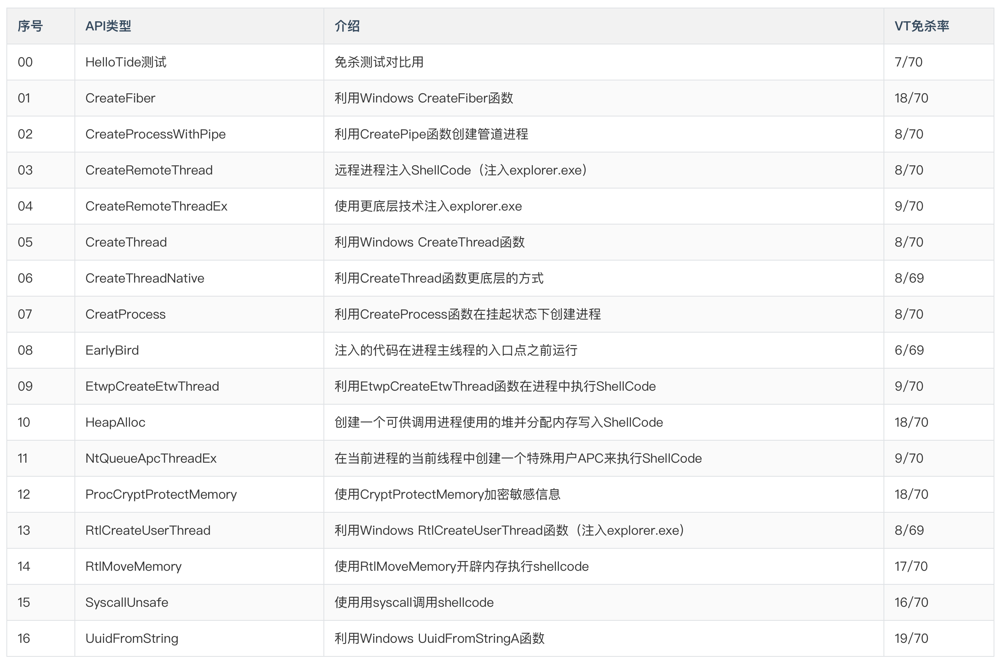

# 0x03 反沙盒检测

在本系列的第75篇文章 **《75.远控免杀专题(75)-基于Go的沙箱检测》** 中，对常见的**8种沙盒检测方式**进行了总结。

具体沙盒检测代码在这里：`https://github.com/TideSec/GoBypassAV/tree/main/SandBox`

测试结果为如下。

未使用沙箱检测技术的，VT查杀结果为：10/71

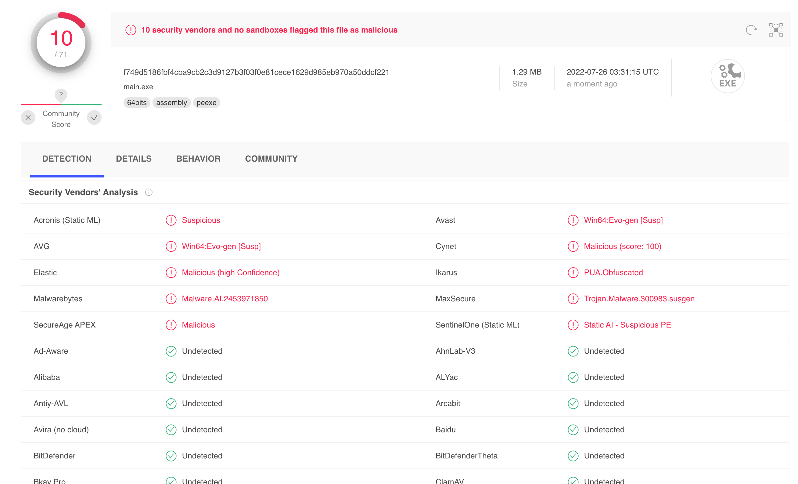

使用了沙箱检测技术的，VT查杀结果为：8/70

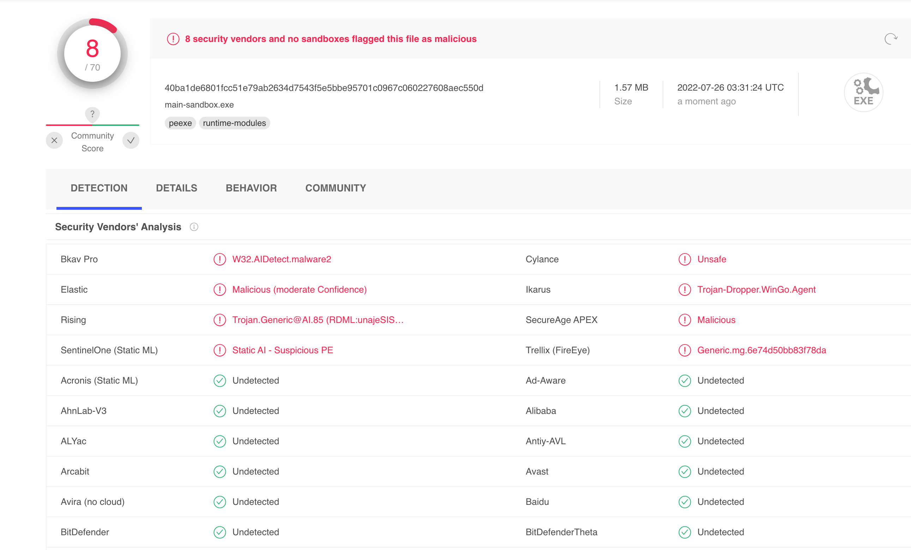

这些都属于比较常规、简单且已经公开的方式，所以差别不是很大，沙盒基本都能反反检测了。

# 0x04 Go编译对免杀的影响

在使用Go进行免杀的时候，`go build`的编译选项也对免杀效果有较大影响。

在编译时，常用的编译命令为`go build -ldflags="-s -w -H=windowsgui"`

测试使用的平台为VT平台：`https://virustotal.com/`，使用的是专题76中的`HelloTide`代码。

1. 直接使用`go build `，**VT免杀率7/70**，免杀效果最好的，但文件相对比较大，一个`helloworld`都能1.8M。

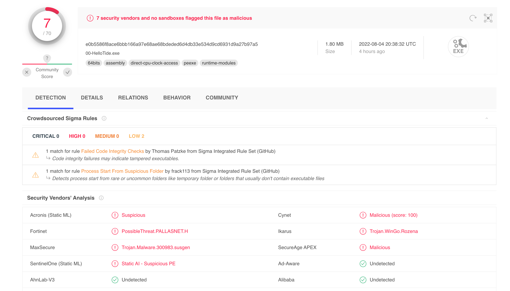

2. `-ldflags="-s -w"`参数：**VT免杀率7/70**，主要是减小文件大小，`helloworld`能缩减到1.2M，没有增强免杀效果。

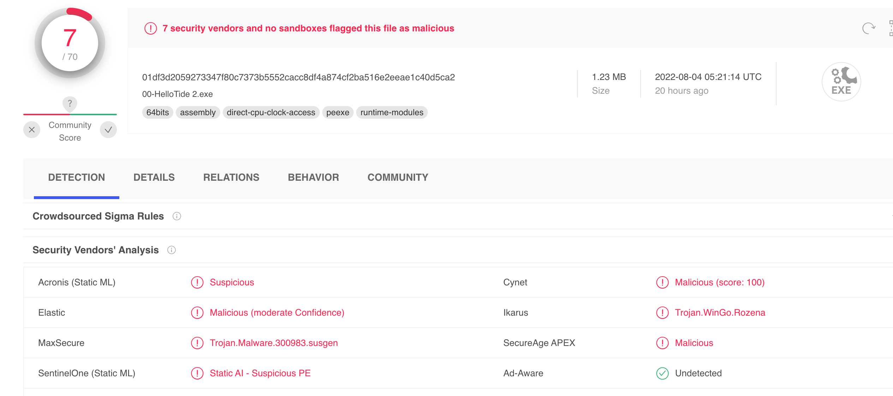

3. `-ldflags="-H=windowsgui"`参数：**VT免杀率13/70**，主要是隐藏窗口，但会降低免杀效果，VT查杀增加4。

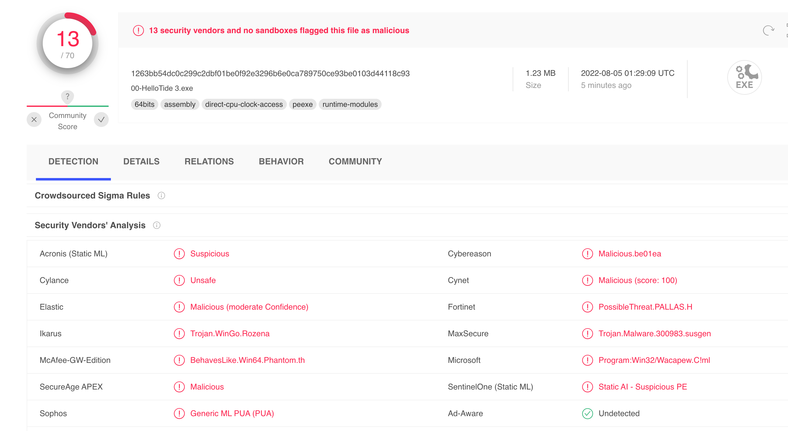

4. `-race`参数：**VT免杀率20/70**，在2021年的时候这个参数效果很好，但现在已经不能用了，正常的`helloworld`加上这个参数后VT平台直接16个报病毒。


所以比较推荐的编译命令为`go build -ldflags="-s -w"`，但是这样就会有黑窗口，后面会说如何解决黑窗口的隐藏问题。

# 0x05 加壳混淆
对程序进行加壳或者混淆也是常用的免杀方式，本系列文章之前也介绍过一些加壳软件，比如upx加壳之类的，这里对比一下对Go程序进行UPX加壳的免杀效果。

还是使用上面`go build `，**VT免杀率7/70**的程序进行加壳对比。

## 5.1 upx加壳

使用最优加壳`upx --best 00-HelloTide.exe -o upx-hello.exe`

加壳后大小从1.8M降为1.08M，但是VT免杀率降到了13/70。


## 5.2 shielden加壳
使用`safengine shielden 加壳2.4.0.0`软件进行加壳，加壳后文件居然变大到了2.5M，VT免杀率居然降到了33/70，可以直接放弃这个了。

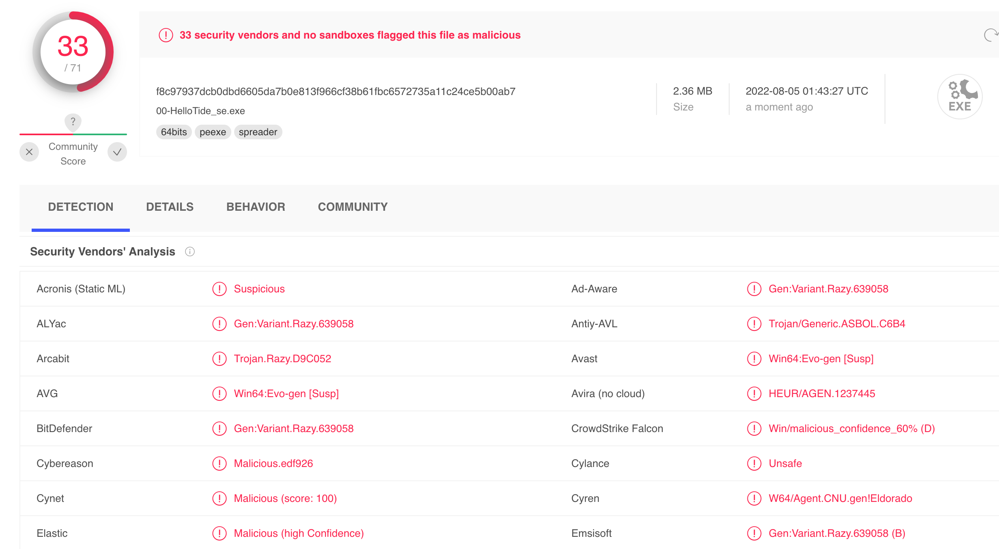

## 5.3 VMProtect加壳

使用`VMProtect Ultimate 3.4.0` 进行加壳，加壳后文件居然6.3M，VT免杀率居然降到了19/70。文件那么大，免杀效果也一般，也可以放弃了。

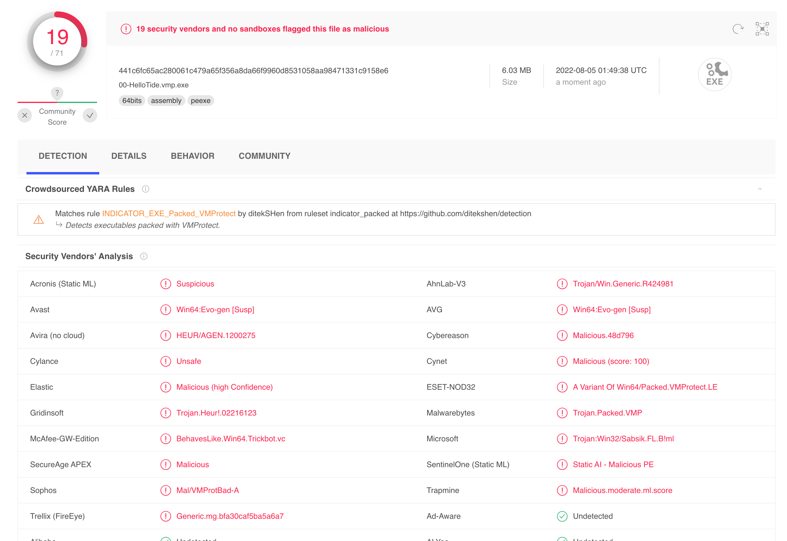

## 5.4 garble代码混淆

使用`garble`可对Go程序进行编译混淆，起到一定的免杀作用。
项目地址：`https://github.com/burrowers/garble`

在项目中直接使用`garble.exe build `，即可编译，编译文件变小为1.2M。

额，结果略尴尬。

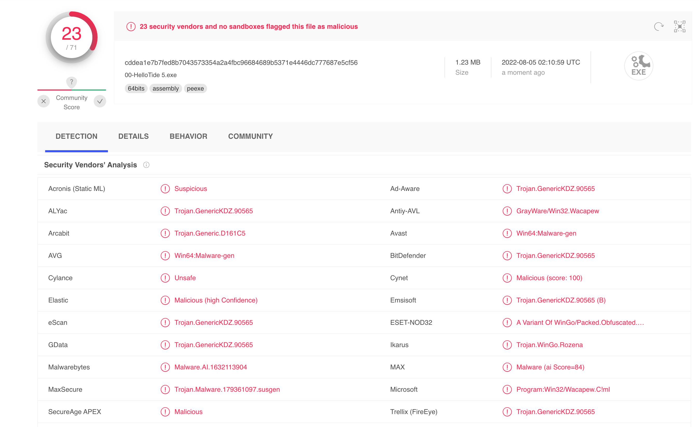

使用两个参数`garble.exe -literals -seed=random build`，再次测试，还是略尴尬。

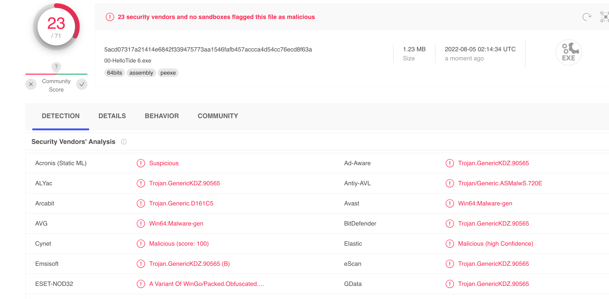


# 0x06 对shellcode加密

在免杀中对payload进行先解密，然后运行时再解密，从而逃避杀软的静态检测算是比较常见而有效的一种方式，我这里搜集整理了**9种常见的Golang的加解密方法**。

## 6.1 异或xor加密 
 
 这个比较简单，设置个自己的密钥就可以，在`潮影在线免杀平台：http://bypass.tidesec.com/`中也使用了异或加密。
 
 详细代码在这里：`https://github.com/TideSec/GoBypassAV/tree/main/Encryption/XOR_code`
 
 ## 6.2 Base64编码
 
GO内置了base64的包，可直接调用，也可对shellcode进行多轮的base64编码。

```go
package main
import (
	"encoding/base64"
	"fmt"
)
func main(){
	var str = "tidesec"
	strbytes := []byte(str)
	encoded := base64.StdEncoding.EncodeToString(strbytes)
	fmt.Println(encoded)
	decoded, _ := base64.StdEncoding.DecodeString(encoded)
	decodestr := string(decoded)
	fmt.Println(decodestr)
}
```

## 6.3 AES加密

高级加密标准（Advanced Encryption Standard，缩写：AES），是美国联邦政府采用的一种区块加密标准。现在，高级加密标准已然成为对称密钥加密中最流行的算法之一。

AES实现的方式有5种:

* 1.电码本模式（Electronic Codebook Book (ECB)）
* 2.密码分组链接模式（Cipher Block Chaining (CBC)）
* 3.计算器模式（Counter (CTR)）
* 4.密码反馈模式（Cipher FeedBack (CFB)）
* 5.输出反馈模式（Output FeedBack (OFB)）

我这是采用的是电码本模式Electronic Codebook Book (ECB)。

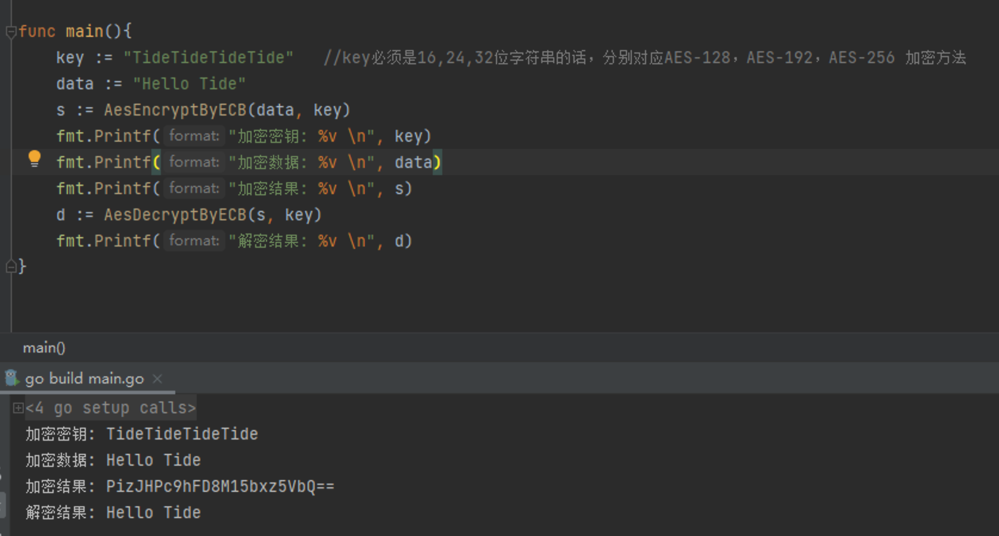

代码在这里：`https://github.com/TideSec/GoBypassAV/tree/main/Encryption/AES_code`

代码参考`http://liuqh.icu/2021/06/19/go/package/16-aes/`

## 6.4 RC4加密

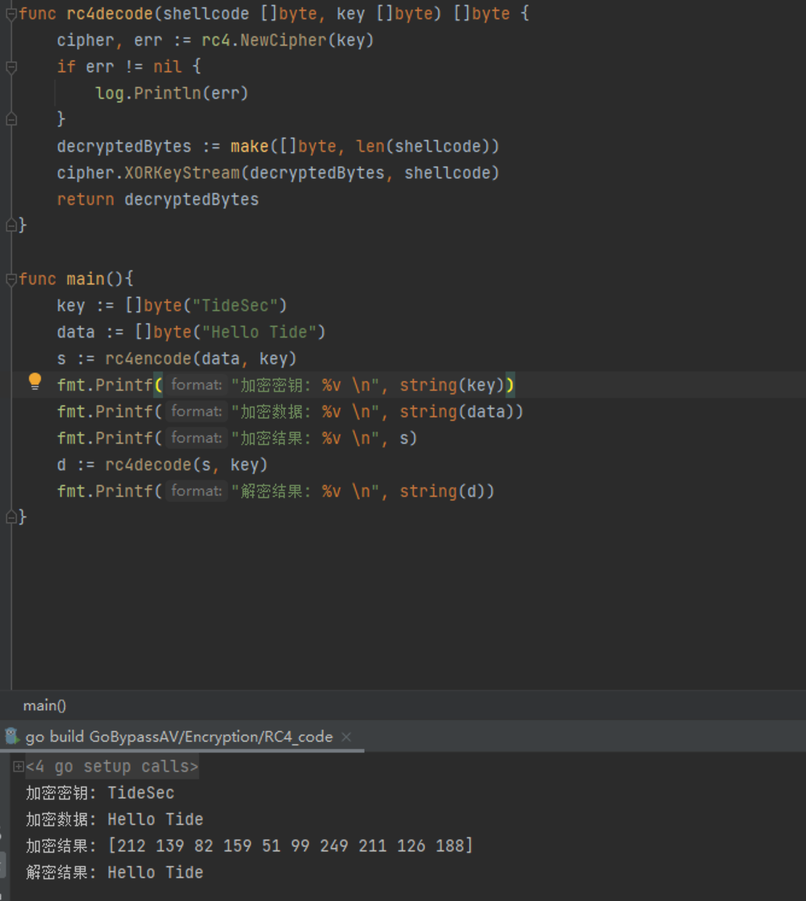

## 6.5 B85加密

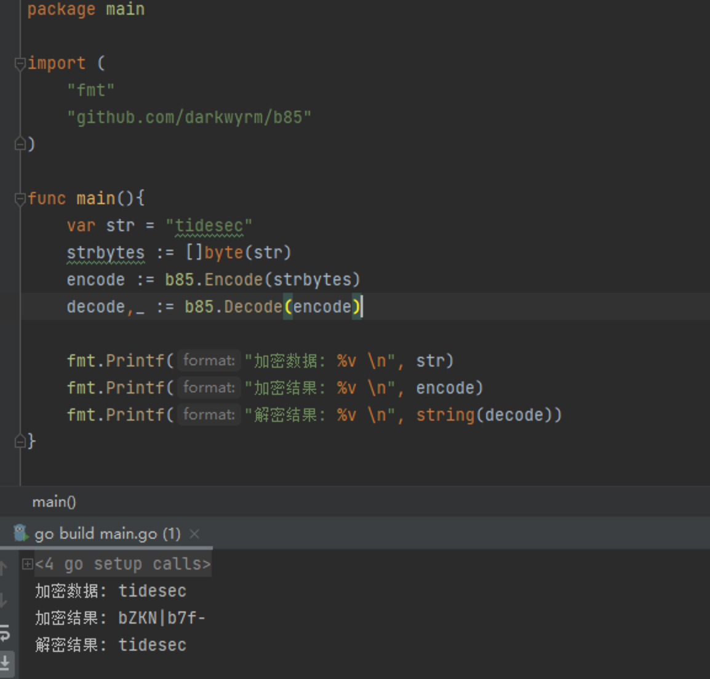

参考代码:`https://github.com/darkwyrm/b85`

## 6.6 八卦加密

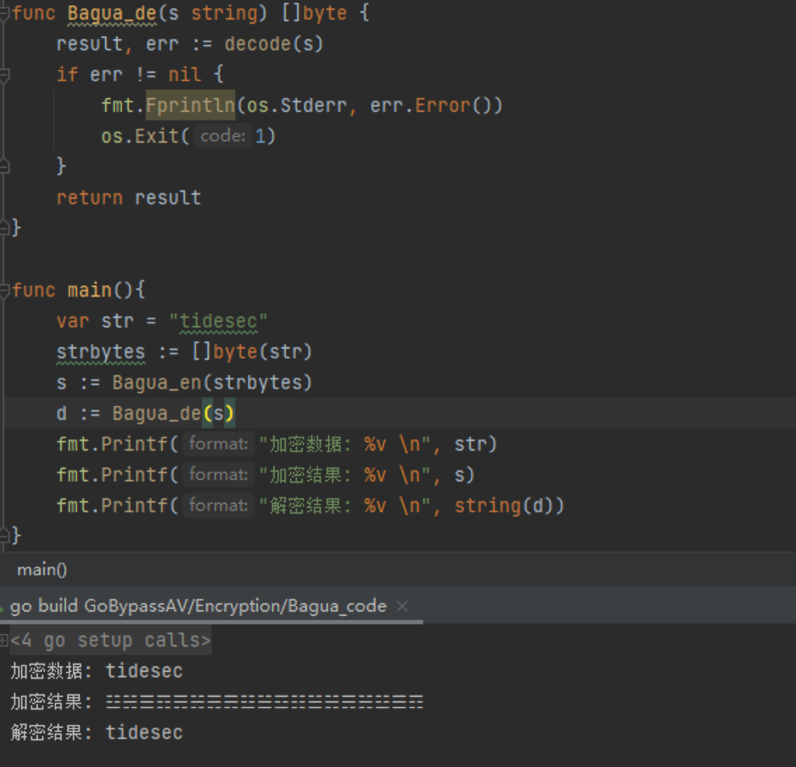

代码参考:`https://github.com/Arks7/Go_Bypass`

## 6.7 三重DES、RSA加密

偶然发现了一个专门的GO的加解密项目，很全面。

项目地址：`https://github.com/wumansgy/goEncrypt`

go语言封装的各种对称加密和非对称加密，可以直接使用，包括3重DES，AES的CBC和CTR模式，还有RSA非对称加密。

我把源码打包放在了这里`https://github.com/TideSec/GoBypassAV/tree/main/Encryption/goEncrypt`

## 6.8 ShellcodeUtils

一个专门针对shellcode进行加解密的脚本，可以实现XOR、AES256、RC4的加解密。
`https://github.com/TideSec/GoBypassAV/tree/main/Encryption/ShellcodeUtils`

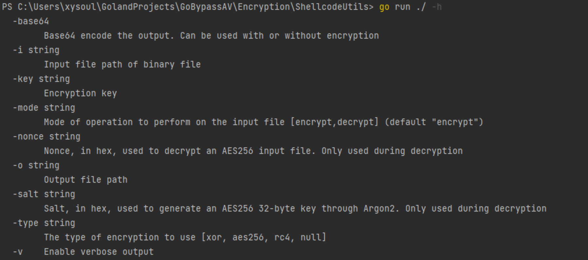

# 0x07 资源修改

资源修改主要是修改图标、增加签名之类的。

从网上找到了一个Go语言的伪造签名的代码，Go版和Python版的代码在这里` https://github.com/TideSec/GoBypassAV/tree/main/SignThief`。

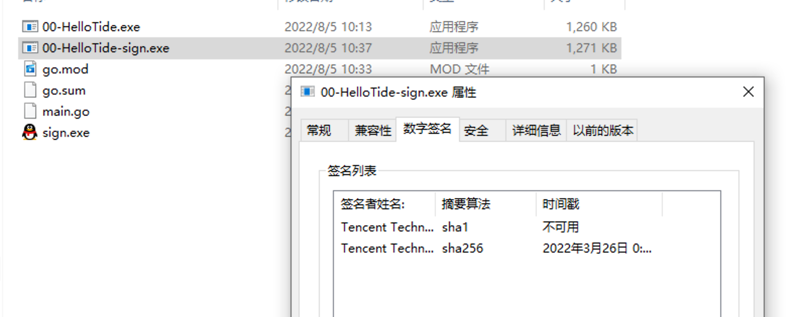


其他资源修改之前的文章也都有介绍**《68.远控免杀专题(68)-Mimikatz免杀实践(上)》**。

该案例是对mimikatz可执行程序的免杀测试，我这直接摘过来了。
```
这里先介绍一种比较常见的pe免杀方法，就是替换资源+加壳+签名，有能力的还可以pe修改，而且mimikatz是开源的，针对源码进行免杀处理效果会更好，这里不多做讨论。
```
需要几个软件，VMProtect Ultimate 3.4.0加壳软件，下载链接: `https://pan.baidu.com/s/1VXaZgZ1YlVQW9P3B_ciChg` 提取码: emnq

签名软件`https://raw.githubusercontent.com/TideSec/BypassAntiVirus/master/tools/mimikatz/sigthief.py`

资源替换软件ResHacker：`https://github.com/TideSec/BypassAntiVirus/blob/master/tools/mimikatz/ResHacker.zip`

先替换资源，使用ResHacker打开mimikatz.exe，然后在图标里替换为360图标，version里面文字自己随意更改。

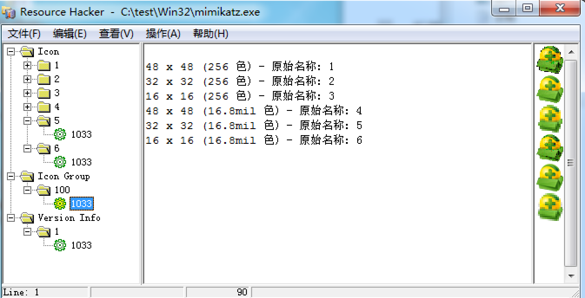

安装vmp加壳软件后，使用vmp进行加壳

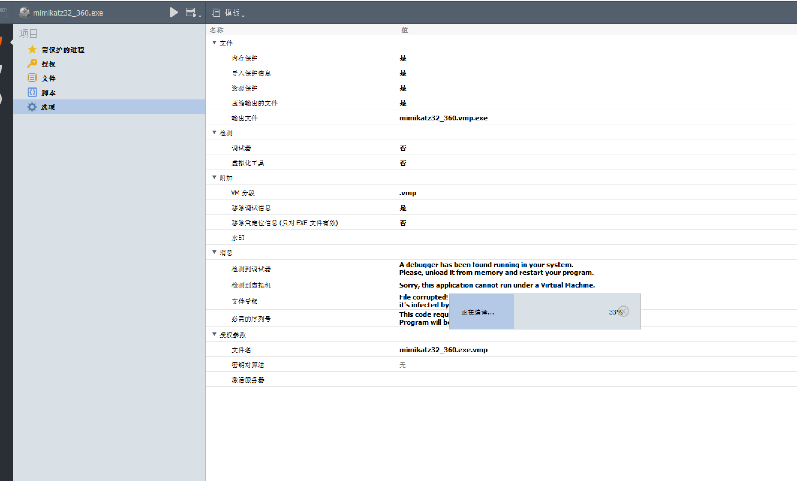

使用`sigthief.py`对上一步生成的exe文件进行签名。sigthief的详细用法可以参考`https://github.com/secretsquirrel/SigThief`。


然后看看能不能运行，360和火绒都没问题。

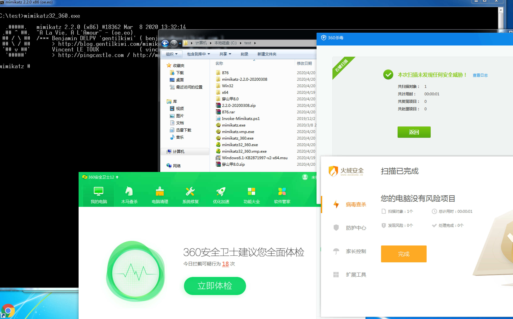

VT平台上`mimikatz32_360.exe`文件查杀率9/70，缺点就是vmp加壳后会变得比较大。

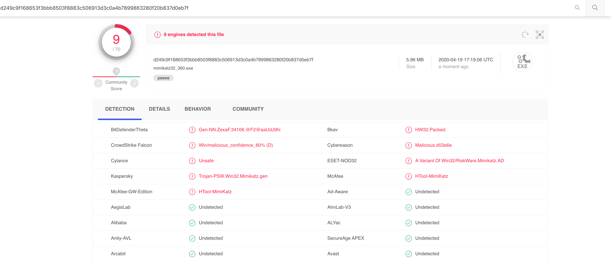

# 0x08 架构的影响

编译生成的程序如果x86或x64架构不同，那么对免杀的影响也很大，整理来说x64程序免杀更好一些。

我以专题76中提到的`08-EarlyBird`为例进行测试，正常x64免杀为7/70。


编译x86架构的程序，VT免杀为21/70，差的还是比较大的。


# 0x09 隐藏窗口

常规的隐藏窗口一般都是使用`-H=windowsgui`参数，但这样会增大杀软查杀的概率。

我这提供两种隐藏窗口的代码。

完整代码在这里`https://github.com/TideSec/GoBypassAV/tree/main/HideWindow`

```
package main

import "github.com/gonutz/ide/w32"

func ShowConsoleAsync(commandShow uintptr) {
	console := w32.GetConsoleWindow()
	if console != 0 {
		_, consoleProcID := w32.GetWindowThreadProcessId(console)
		if w32.GetCurrentProcessId() == consoleProcID {
			w32.ShowWindowAsync(console, commandShow)
		}
	}
}

func main() {
	ShowConsoleAsync(w32.SW_HIDE)
}
```

另外一种，相比第一种，生成的文件略大一点。
```
package main

import "github.com/lxn/win"

func main(){
	win.ShowWindow(win.GetConsoleWindow(), win.SW_HIDE)
}
```

# 0x10 小结

综上，做Go的免杀时，要注意下面几点。

**1. API的选择比较关键。
2. 选择合适的加密方式来处理shellcode
3. 尽量生成x64的shellcode，生成x64位程序
4. 编译时建议使用`go build -ldflags="-s -w"`，也可以使用`garble`
5. 加壳的话可以使用upx，其他如果有更好的也可以使用
6. 修改资源、加签名有一定效果
7. 好的反沙盒技巧还是很有效的
8. 隐藏窗口不要使用`-H=windowsgui`参数
9. 使用分配虚假内存等方式可绕过部分杀软
10. 采用正常功能进行混淆，可增强免杀效果，但文件可能变大很多**

# 0x11 Go免杀实践

通过对Go免杀的研究，实现了一个在线免杀平，主要用于杀软技术研究和样本分析。同时也方便有免杀需求，但没时间和精力去研究免杀的小伙伴。

**潮影在线免杀平台：[http://bypass.tidesec.com/](http://bypass.tidesec.com/)**


平台上使用了基于Go的7种API，并结合使用了上面的shellcode加密、沙盒检测、行为混淆、随机函数等方式后，可实现VT平台查杀率3/70。而在使用了shellcode分离后，目前可实现VT平台0查杀。

选择“URL加载”-“是”，生成的TideAv_Go_XXXX_img.exe可以做到VT全免杀，支持本地文件加载和网络加载，图片内置隐写的shellcode。

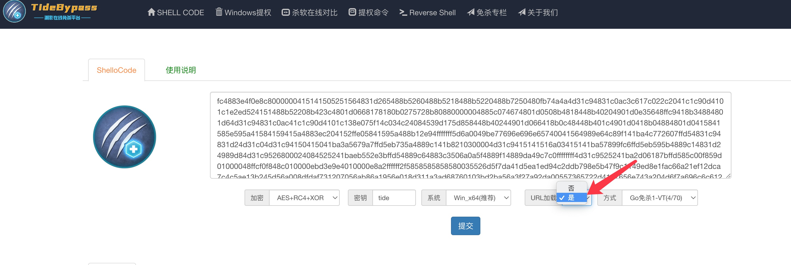

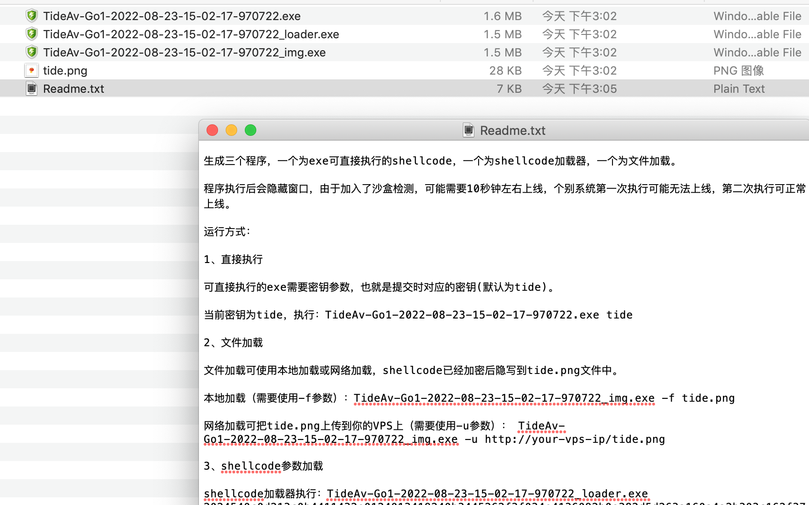


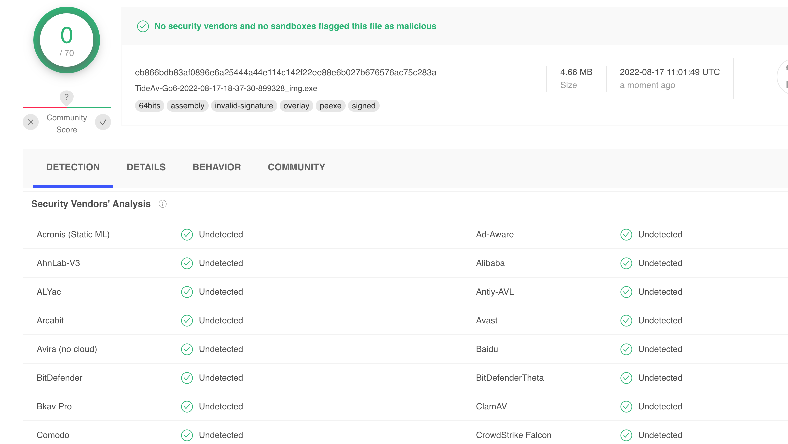

另外，目前还添加了两种基于Python的免杀方式，一种是基于RSA加密，一种是基于pickle反序列化。使用pyinstaller打包，经过一些bypass处理，目前也可以接近VT平台0查杀。具体Python免杀的实现后续文章会介绍。

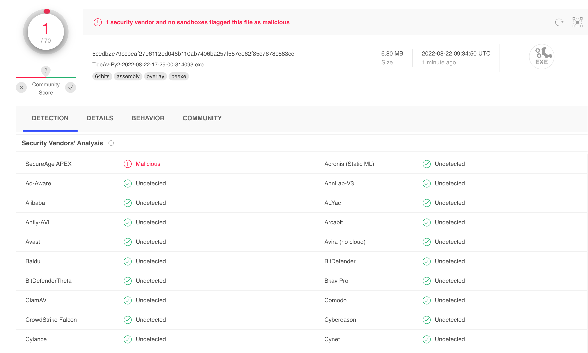


# 0x11 参考资料

本文内容参考节选自以下资料：

go-shellcode项目：`https://github.com/Ne0nd0g/go-shellcode`

safe6Sec大佬：`https://github.com/safe6Sec/GolangBypassAV`

GoBypass：`https://github.com/afwu/GoBypass`

AniYa免杀：`https://github.com/piiperxyz/AniYa`

Go加解密：`https://github.com/wumansgy/goEncrypt`
